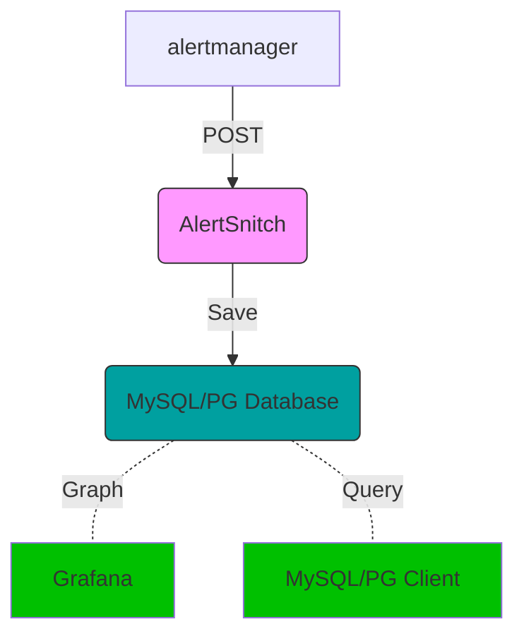

# AlertSnitch

Captures Prometheus AlertManager alerts and writes them in a MySQL or
Postgres database for future examination.

Because given a noisy enough alerting environment, offline querying
capabilities of triggered alerts is extremely valuable.

## How does it work

1. You stand up one of these however you like (multi-arch Docker images provided)
1. You setup AlertManager to point at it and propagate your alerts in.
1. Every alert that gets triggered reaches your database.
1. Profit.



## Local install

Simply install to your $GOPATH using your GO tools

```sh
$ go get github.com/todevops/alertsnitch`
```

## Requirements

To run AlertSnitch requires a MySQL or Postgres database to write to.

The database must be initialized with AlertSnitch model.

AlertSnitch will not become online until the model is up to date with the
expected one. Bootstrapping scripts are provided in the [scripts][./script.d]
folder.

## Configuration

### MySQL

For specifics about how to set up the MySQL DSN refer to [Go MySQL client driver][1]

This is a sample of a DSN that would connect to the local host over a Unix socket

```bash
MYSQL_USER="snitch"
MYSQL_PASSWORD="password"
MYSQL_HOST="localhost:3306"
MYSQL_DATABASE="alertsnitch"
export SERVER_PORT=":8080"
export DB_BACKEND="mysql"
export DSN="${MYSQL_USER}:${MYSQL_PASSWORD}@tcp(${MYSQL_HOST})/${MYSQL_DATABASE}"
```

### Postgres

```bash
export DB_BACKEND="postgres"
export DSN="sslmode=disable user=${PGUSER} password=${PGPASSWORD} host=${PGHOST} database=${PGDATABASE}"
```