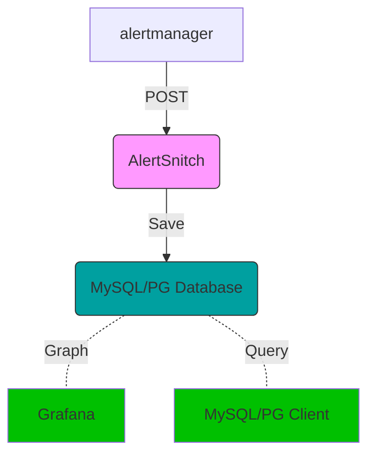

# AlertSnitch

捕获 Prometheus AlertManager 告警信息，并将它们写入 MySQL 或 Postgres 数据库中

## 它是如何工作的



## 本地安装

只需使用 GO 工具安装到您的 $GOPATH

```sh
$ go get github.com/todevops/alertsnitch`
```

## 要求

要运行警报，需要一个MySQL或Postgres数据库来编写。

数据库必须使用 AlertSnitch 模型进行初始化。

## 配置

### MySQL

有关如何设置 MySQL DSN 的要点，请参阅 [Go MySQL client driver](https://github.com/go-sql-driver/mysql)

这是通过 Unix 插座连接到本地主机的 DSN 示例：

```bash
MYSQL_USER="snitch"
MYSQL_PASSWORD="password"
MYSQL_HOST="localhost:3306"
MYSQL_DATABASE="alertsnitch"
export SERVER_PORT=":8080"
export DB_BACKEND="mysql"
export DSN="${MYSQL_USER}:${MYSQL_PASSWORD}@tcp(${MYSQL_HOST})/${MYSQL_DATABASE}"
```

### Postgres

```bash
export DB_BACKEND="postgres"
export DSN="sslmode=disable user=${PGUSER} password=${PGPASSWORD} host=${PGHOST} database=${PGDATABASE}"
```